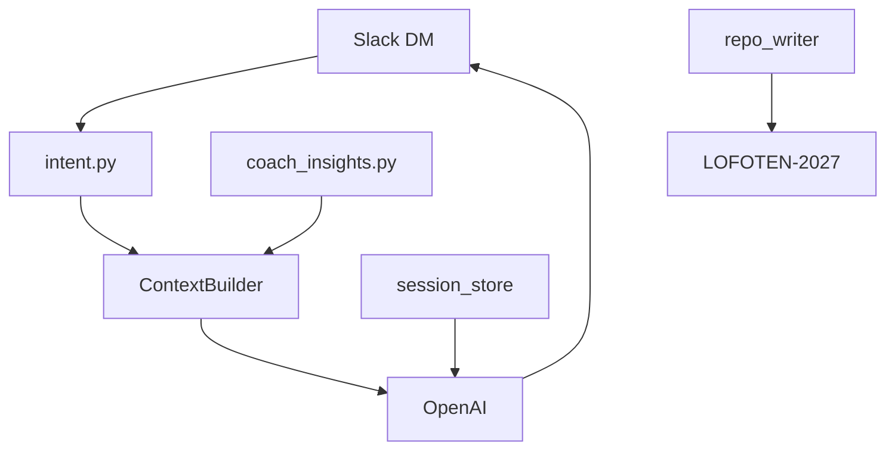

# Lofoten AI Coach – arkitektur

## Data-eierskap

| System | Source of truth |
|--------|-----------------|
| intervals.icu | Økter, wellness (CTL/ATL), belastning, kalenderplan (events) |
| LOFOTEN-2027/ | Mål, masterplan, CURRENT_STATUS, ukeplan, beslutninger |
| Slack DM | Brukergrensesnitt |
| coach-bot/data/sessions.db | Kort samtaleminne (lokal/sky) |

## Flyt

Transport: **Slack Socket Mode**. Health HTTP på port 3000.

## Moduler (coach-bot)

| Modul | Rolle |
|-------|--------|
| `IntervalsClient` | Activities, events, wellness (+ cache) |
| `aggregates` | Volum, plan_vs_actual, wellness trends |
| `coach_insights` | **COACH_BRIEF** (deterministisk analyse) |
| `intent` | Klassifiser DM (status, uke, i morgen, logg, …) |
| `RepoReader` / `RepoWriter` | Les plan; `logg:` → CURRENT_STATUS |
| `ContextBuilder` | Intent-trimmet kontekst + COACH_BRIEF |
| `SessionStore` | SQLite, siste N turner |
| `CoachOrchestrator` | run_chat, morgen/uke-briefing |
| `proactive` | APScheduler morgen + søndag uke |

## DM-kommandoer (naturlig språk)

- Status, ukestatus, i morgen, race/spørsmål, smerte
- `logg: …` → append under «Kort notat» i CURRENT_STATUS
- `ping` → connectivity test (uten LLM)

## Deploy

Se [DEPLOY.md](DEPLOY.md) – Docker/Fly med `LOFOTEN-2027` baked in.

## V2 (implementert)

- Proaktiv DM + `briefing: test|morgen|uke`
- Block Kit, matplotlib-grafer, multi-turn chat (`SessionStore` → OpenAI messages)
- COACH_BRIEF ADVANCED (ACWR, adherence, konsistens)
- Intervals write: uke-preview + `ja`, enkeltøkt auto (`intervals_planner` + bulk upsert)
- `POST /admin/briefing` med `X-Admin-Secret`

## Persistens (SQLite vs Supabase)

- **Nå:** [`session_store.py`](../coach-bot/src/coach_bot/session_store.py) (SQLite) – samtale + `pending_actions` for Intervals-bekreftelse.
- **Fly:** Ephemeral disk – `sessions.db` kan nullstilles ved redeploy (pending «ja» kan forsvinne). Valgfritt Fly volume eller restart etter deploy.
- **Fase 2 (valgfri):** Supabase kun som `SessionStore`-backend (samme API, tabeller `turns` + `pending_actions`). **Ikke** flytt COACH_BRIEF, Intervals eller repo-hit dit. Intervals + git forblir source of truth.

## Senere

- Web-UI
