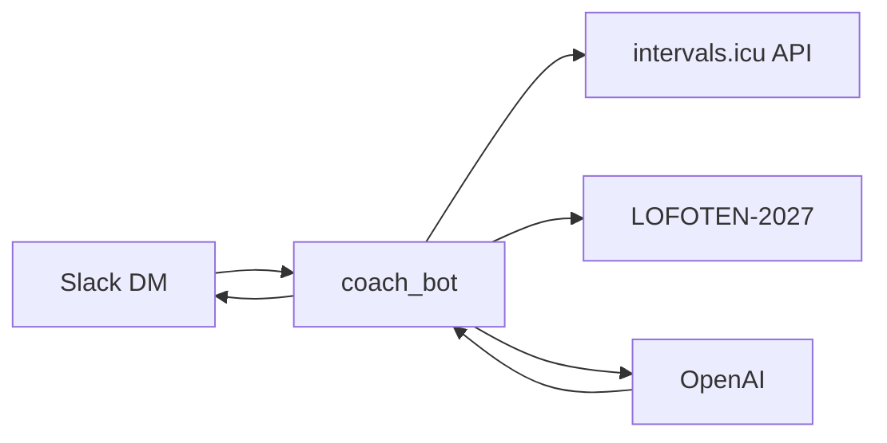

# Lofoten AI Coach – arkitektur

## Data-eierskap

| System | Source of truth |
|--------|-----------------|
| intervals.icu | Økter, wellness, belastning, kalenderplan (events) |
| LOFOTEN-2027/ | Mål, masterplan, CURRENT_STATUS, beslutninger, strategi |
| Slack DM | Brukergrensesnitt |

Rå økter lagres ikke som masse markdown i repo.

## Flyt

Transport: **Slack Socket Mode** (ingen tunnel). Valgfri morgen-DM via scheduler.

## Moduler (coach-bot)

- `IntervalsClient` – activities, events, wellness (cache + parallel fetch)
- `RepoReader` – les markdown fra disk
- `ContextBuilder` – kompakt kontekst til LLM (`for_chat`)
- `CoachOrchestrator` – `run_chat` / `run_morning_briefing`
- `slack_handlers` – DM `message` events
- `proactive` – morgenbriefing (valgfritt)

## Senere (ikke i denne builden)

- `/logg` subjektive notater → repo
- Godkjent planendring → Intervals/repo
