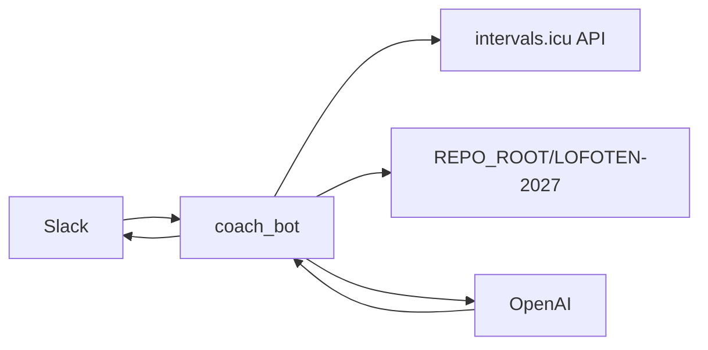

# Lofoten AI Coach – arkitektur

## Data-eierskap

| System | Source of truth |
|--------|-----------------|
| intervals.icu | Økter, wellness, belastning, kalenderplan (events) |
| LOFOTEN-2027/ | Mål, masterplan, CURRENT_STATUS, beslutninger, strategi |
| Slack | Brukergrensesnitt (V1: slash commands) |

Rå økter lagres ikke som masse markdown i repo.

## V1 flyt

## Moduler (coach-bot)

- `IntervalsClient` – activities, events, wellness
- `RepoReader` – les markdown fra disk
- `ContextBuilder` – kompakt kontekst til LLM
- `CoachOrchestrator` – per kommando
- `slack_handlers` – `/status`, `/imorgen`, `/ukestatus`

## Roadmap

| Versjon | Innhold |
|---------|---------|
| V1 | Slash commands, read-only repo |
| V2 | `/logg` subjektive notater → repo |
| V3 | Proaktiv morgenmelding (cron) |
| V4 | Foreslå planendring → godkjenn → Intervals/repo |

## Porter (utvidelse)

- `TrainingDataProvider` – Intervals i V1
- `PlanProvider` – Intervals events
- `ProjectMemory` – RepoReader
- `Notifier` – Slack
- `Scheduler` – stub til V3
